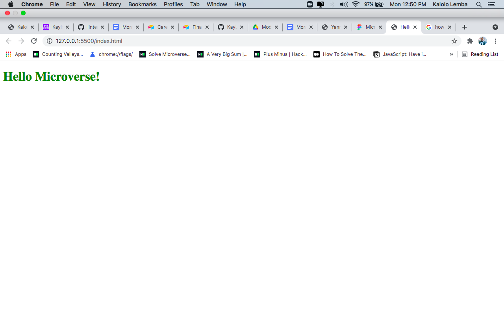

# Hello Microverse Project For Microverse

> This is a simple web develoment project for microverse created using simple HTML(Hyper text mark-up Language.) and CSS(Cascading Style Sheet) which is used for styling or decorating the webpage 

Additional description about the project and its features.

## Built With

- Html
- css

## Getting Started

To get a local copy up and running follow these simple example steps.

To download my repository from Github you should navigate to the top left level of the project and the green code download button will be visible on the right hand side.
Select the download Zip option from the pull down Menu. The Zip file will contain the entire repository content which can be set-up locally.Use this link to access my repository on Github :https://github.com/KayLemba/HelloMicroverse2

## Authors

👤 **Kalolo Chola Lemba**

- GitHub: [@githubhandle](https://github.com/KayLemba)

## 🤝 Contributing

Contributions, issues, and feature requests are welcome!

Feel free to check the [issues page](../../issues/).

## Show your support

Give a ⭐️ if you like this project!

## Acknowledgments

- Hat tip to anyone whose code was used
- Inspiration
- etc

## 📝 License

This project is [MIT](./MIT.md) licensed.
